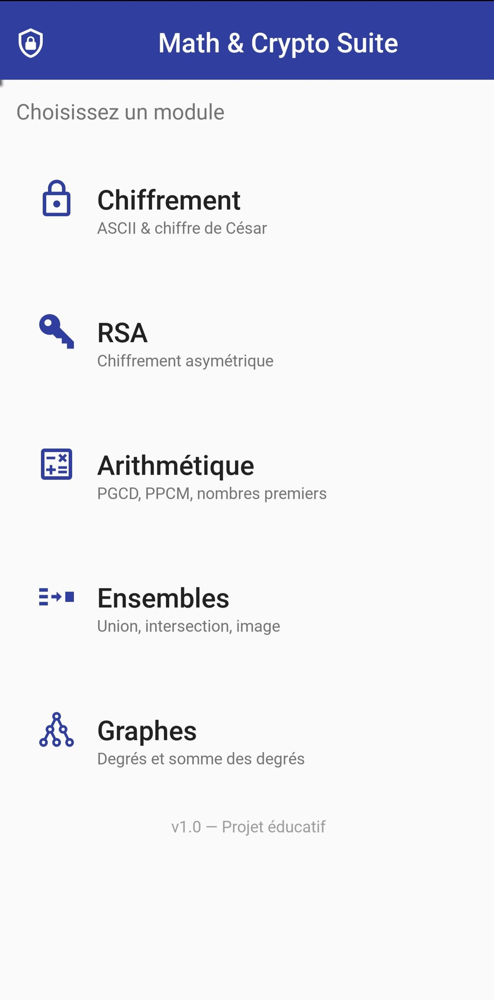
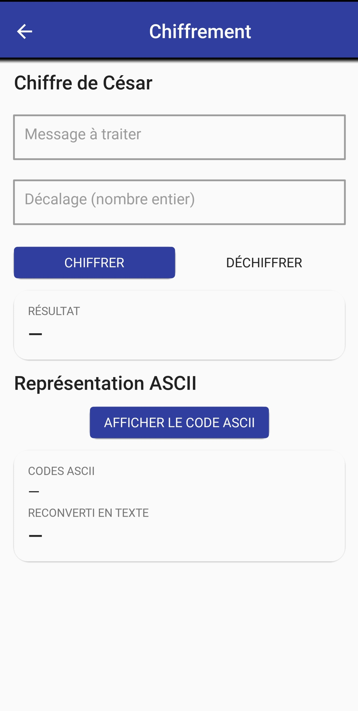
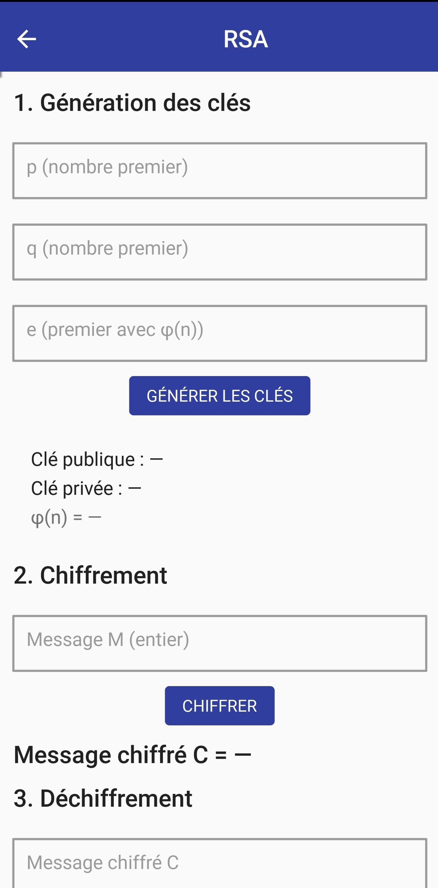
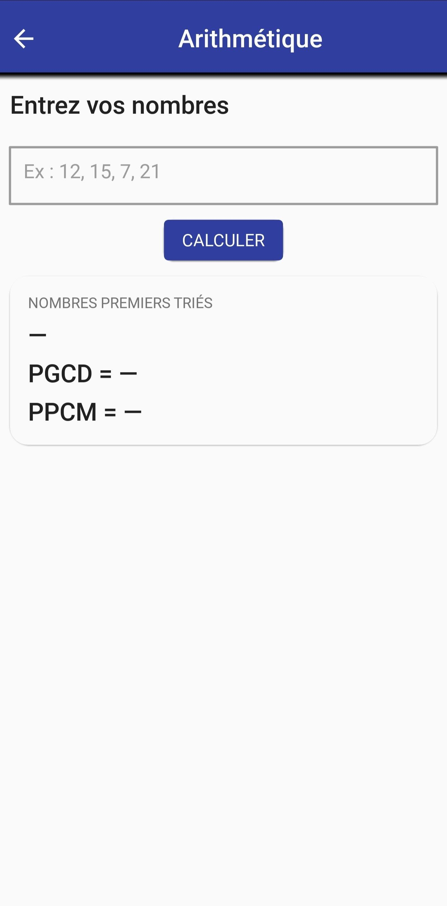
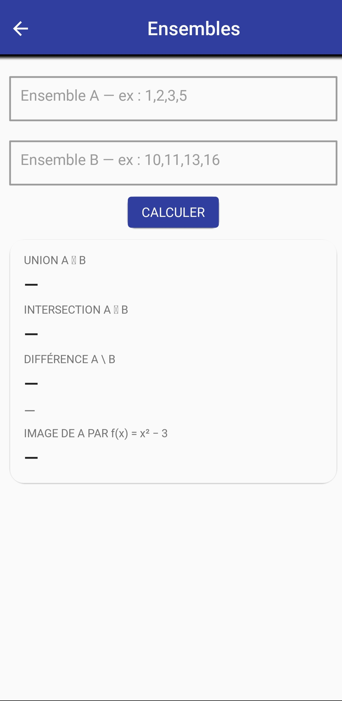
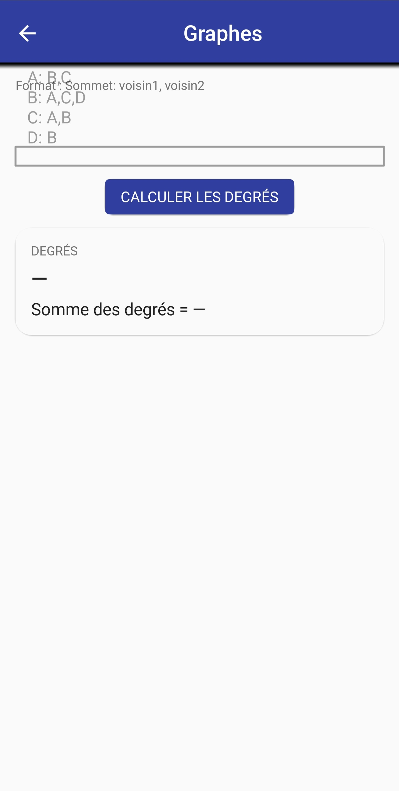

# 🎓 Math & Crypto Suite — Application mobile éducative de cryptographie et mathématiques discrètes

Application mobile Android permettant d'explorer de manière interactive les notions fondamentales de **cryptographie** et de **mathématiques discrètes** à travers cinq modules pédagogiques : chiffrement (ASCII et César), RSA, arithmétique (PGCD, PPCM, nombres premiers), ensembles et graphes. Les calculs sont effectués en temps réel avec une interface Material Design moderne.

[](https://www.python.org/)
[](https://kivy.org/)
[](https://kivymd.readthedocs.io/)
[](https://www.android.com/)
[](LICENSE)

---

## 🎯 Objectif du projet

L'apprentissage de la cryptographie et des mathématiques discrètes reste souvent théorique : les étudiants manipulent des formules abstraites sans visualiser concrètement les mécanismes sous-jacents (comment un chiffrement transforme un message, comment RSA génère une clé, comment un graphe se structure).

Ce projet propose donc une solution qui :

- **rend visibles** les transformations cryptographiques (texte → ASCII → chiffré) ;
- **permet de manipuler** RSA pas à pas (génération de clés, chiffrement, déchiffrement) ;
- **automatise** les calculs arithmétiques répétitifs (PGCD, PPCM, test de primalité) ;
- **illustre** les opérations sur les ensembles et les graphes par des cas concrets ;
- **fonctionne hors-ligne**, sans publicité, dans un format léger (< 30 Mo).

---

## 📌 Problématique

Comment concevoir une application mobile éducative, légère et hors-ligne, capable de rendre interactifs et visuellement clairs les concepts abstraits de cryptographie et de mathématiques discrètes, tout en restant accessible aux étudiants et aux enseignants ?

---

## 🏗️ Architecture du projet

Le projet suit une architecture **monolithique côté client** : toute la logique est embarquée dans l'application, séparant clairement la logique métier (Python pur) de l'interface graphique (Kivy/KivyMD).

```text
                   ┌───────────────────────────┐
                   │   Saisie utilisateur      │
                   │  (texte, nombres, graphe) │
                   └─────────────┬─────────────┘
                                 │
                                 ▼
                   ┌───────────────────────────┐
                   │    Interface KivyMD       │
                   │   (écrans .kv Material)   │
                   └─────────────┬─────────────┘
                                 │
                                 ▼
                   ┌───────────────────────────┐
                   │    Logique métier Python  │
                   │        (dossier core/)    │
                   └─────────────┬─────────────┘
                                 │
                 ┌───────────────┼───────────────┐
                 ▼               ▼               ▼
       ┌─────────────┐   ┌─────────────┐   ┌─────────────┐
       │ Chiffrement │   │     RSA     │   │ Arithmétique│
       │ ASCII/César │   │  (modulaire)│   │  PGCD/PPCM  │
       └─────────────┘   └─────────────┘   └─────────────┘
                 │               │               │
                 └───────────────┼───────────────┘
                                 ▼
                   ┌───────────────────────────┐
                   │    Ensembles & Graphes    │
                   │  (opérations ensemblistes │
                   │     et degrés)            │
                   └─────────────┬─────────────┘
                                 │
                                 ▼
                   ┌───────────────────────────┐
                   │      Buildozer → APK      │
                   │   (compilation Android)   │
                   └───────────────────────────┘
```

---

## 🛠️ Technologies utilisées

### Frontend mobile

- **Kivy 2.3.0** — framework graphique multiplateforme
- **KivyMD 1.1.1** — composants Material Design
- Fichiers `.kv` — définition déclarative des interfaces
- **Pillow** — gestion de l'icône de l'application

### Logique métier

- **Python 3.11.9** — langage principal
- **Modules internes** (`core/`) — chiffrement, RSA, arithmétique, ensembles, graphes

### Compilation & déploiement

- **Buildozer 1.5+** — génération de l'APK Android
- **python-for-android** — moteur de conversion Python → Android
- **OpenJDK 17** + **Android SDK 33** + **NDK 25b**
- **Docker** — build reproductible en local
- **GitHub Actions** — automatisation possible

---

## 📁 Structure du projet

```text
math_crypto_suite/
│
├── main.py                  # Point d'entrée KivyMD (écrans + logique UI)
├── buildozer.spec           # Configuration du build Android
├── .gitignore               # Fichiers exclus du versionnement
├── README.md                # Ce fichier
├── LICENSE                  # Licence MIT
│
├── core/                    # Logique métier (Python pur, testable)
│   ├── __init__.py
│   ├── chiffrement.py       # ASCII + chiffre de César
│   ├── arithmetique.py      # PGCD, PPCM, nombres premiers
│   ├── rsa.py               # Génération de clés, chiffrement/déchiffrement
│   ├── ensembles.py         # Union, intersection, image par fonction
│   └── graphes.py           # Degrés, somme des degrés
│
├── kv/                      # Interfaces Material Design
│   ├── home.kv              # Écran d'accueil
│   ├── chiffrement.kv
│   ├── rsa.kv
│   ├── arithmetique.kv
│   ├── ensembles.kv
│   └── graphes.kv
│
├── assets/
│   └── icon.jpeg            # Icône de l'application
│
├── docs/                    # Captures d'écran
│   ├── home.jpg
│   ├── chiffrement.jpg
│   ├── rsa.jpg
│   ├── arithmetique.jpg
│   ├── ensembles.jpg
│   └── graphes.jpg
│
└── .github/workflows/
    └── build.yml            # (optionnel) Build automatique
```

---

## 🔄 Fonctionnalités

### 🔒 Module Chiffrement

- **Chiffrement ASCII** : conversion texte ↔ codes ASCII dans les deux sens
- **Chiffre de César** : chiffrement et déchiffrement avec décalage personnalisé
- Préservation de la casse (majuscules / minuscules)
- Validation des saisies (message vide, décalage non entier)

### 🔑 Module RSA

- Génération de clés publiques (e, n) et privées (d, n) à partir de p, q et e
- Vérification automatique que p et q sont premiers
- Calcul de φ(n) et de l'inverse modulaire d
- Chiffrement et déchiffrement d'entiers dans le domaine valide
- Message d'erreur explicite si le message dépasse n

### 🧮 Module Arithmétique

- Test de primalité optimisé (arrêt à √n)
- Tri des nombres premiers d'une liste
- Calcul du **PGCD** (algorithme d'Euclide) sur plusieurs nombres
- Calcul du **PPCM** sur plusieurs nombres
- Gestion des cas limites (moins de deux nombres, liste vide)

### 🎲 Module Ensembles

- Saisie d'ensembles par liste d'entiers
- **Union**, **intersection**, **différence**
- Calcul du **cardinal** de chaque opération
- **Image** d'un ensemble par la fonction f(x) = x² − 3
- Application de la formule de Poincaré

### 🕸️ Module Graphes

- Saisie d'un graphe au format `Sommet: voisin1, voisin2`
- Parsing automatique des lignes
- Calcul du **degré** de chaque sommet
- **Somme des degrés** (vérification du théorème des poignées de main)

### 🔧 Fonctionnalités communes

- Navigation par écrans avec bouton retour matériel (Android)
- Dialogues d'erreur Material Design
- Thème Material You (M3) avec palette Indigo/Teal
- Interface 100 % réactive et hors-ligne

---

## 📸 Captures d'écran

<table>
  <tr>
    <td align="center"><b>🏠 Accueil</b></td>
    <td align="center"><b>🔒 Chiffrement</b></td>
    <td align="center"><b>🔑 RSA</b></td>
  </tr>
  <tr>
    <td></td>
    <td></td>
    <td></td>
  </tr>
  <tr>
    <td align="center"><b>🧮 Arithmétique</b></td>
    <td align="center"><b>🎲 Ensembles</b></td>
    <td align="center"><b>🕸️ Graphes</b></td>
  </tr>
  <tr>
    <td></td>
    <td></td>
    <td></td>
  </tr>
</table>

> 💡 Pour ajouter vos propres captures, placez les images dans `docs/` et nommez-les comme indiqué ci-dessus.

---

## 🧠 Choix de conception — séparation logique / interface

La logique métier est isolée dans le dossier `core/`, sans aucune dépendance à Kivy. Chaque fichier correspond à un domaine fonctionnel unique :

- **Testabilité** : les fonctions peuvent être testées indépendamment de l'interface
- **Réutilisabilité** : le même code pourrait être utilisé dans une API Flask, un script CLI, etc.
- **Maintenabilité** : une modification de l'UI n'affecte pas les algorithmes

C'est un compromis assumé : cela impose de faire transiter les données entre `main.py` et `core/`, mais cela garantit que la logique mathématique reste propre et vérifiable.

---

## 🚀 Installation

### Tester sur PC (Linux / Mac / Windows)

```bash
# Créer un environnement virtuel
python -m venv venv
source venv/bin/activate          # Linux / Mac
venv\Scripts\activate             # Windows

# Installer les dépendances
pip install kivy==2.3.0 kivymd==1.1.1 pillow

# Lancer l'application
python main.py
```

### Compiler l'APK Android — Méthode Docker (recommandée)

**Prérequis** : Docker Desktop installé.

```bash
cd math_crypto_suite
docker run --rm -v ${PWD}:/home/user/hostcwd kivy/buildozer android debug
# → bin/mathcryptosuite-1.0.0-debug.apk
```

### Compiler l'APK Android — Méthode native (Ubuntu 22.04)

```bash
pip install buildozer cython==0.29.36
buildozer -v android debug
```

---

## 📥 Télécharger l'APK

### 🔧 Build local (recommandé)

Une fois le build terminé, l'APK se trouve dans :

```text
bin/mathcryptosuite-1.0.0-debug.apk
```

### 📦 Releases GitHub

L'APK sera disponible dans l'onglet **[Releases](https://github.com/Ranto-nyaina/Math-crypto-suite/releases)** une fois le premier build publié.

### 📱 Installer l'APK sur Android

1. **Activez les sources inconnues** :
   - Paramètres → Sécurité → **Autoriser l'installation depuis des sources inconnues**

2. **Transférez l'APK** sur votre téléphone (USB, Bluetooth, Drive...)

3. **Ouvrez le fichier** `mathcryptosuite-1.0.0-debug.apk`

4. **Appuyez sur Installer**

5. **Lancez l'application** 🎉

### 🐛 Vérifier les erreurs au démarrage

Si l'application plante, utilisez **ADB** :

```bash
sudo apt install adb
adb devices
adb logcat -s python:V kivy:V AndroidRuntime:E
```

### 📊 Alternatives pour compiler l'APK

| Méthode | Avantage | Fiabilité |
|---|---|---|
| **Docker local** | Contrôle total, réseau non filtré | ✅ 95 % |
| **Ubuntu natif** | Le plus rapide | ✅ 95 % |
| **Google Colab** | Simple, sans installation | ⚠️ Instable |
| **GitHub Actions** | Automatique, gratuit | ⚠️ Fragile |

---

## ⚠️ Limites du projet

- **Aucun test automatisé** à ce jour (`pytest` non intégré) ;
- **Icône au format JPEG** : fonctionnelle mais moins optimale qu'un PNG pour le launcher Android ;
- **Interface statique** : pas de mode sombre automatique ni de thème personnalisable ;
- **Module RSA pédagogique** : les clés sont limitées à de petits nombres premiers (pas d'usage cryptographique réel) ;
- **Module Graphes** : ne gère que les graphes non orientés et non pondérés.

---

## 🚀 Perspectives d'amélioration

### Qualité

- ajout de tests unitaires (`pytest`) sur le dossier `core/` ;
- conversion de l'icône en PNG (512×512 px) ;
- ajout d'un mode sombre automatique basé sur le thème système.

### Fonctionnalités

- **Module Graphes** : ajout des graphes orientés, pondérés et du calcul de plus court chemin (Dijkstra) ;
- **Module RSA** : saisie de messages textuels (encodage en blocs) ;
- **Historique** : sauvegarde des calculs dans `JsonStore` ;
- **Export** : partage des résultats en image ou PDF.

### Déploiement

- publication sur le **Google Play Store** (version signée) ;
- génération d'un **AAB** en plus de l'APK ;
- ajout d'un splash screen animé.

---

## 📚 Compétences mises en œuvre

- Développement mobile Android (Kivy, KivyMD)
- Programmation Python orientée module
- Architecture logicielle : séparation logique / UI
- Cryptographie appliquée (César, RSA)
- Algorithmique arithmétique (Euclide, primalité, modularité)
- Théorie des ensembles et des graphes
- Génération d'APK avec Buildozer
- Conteneurisation Docker
- Git / GitHub

---

## 🤝 Contribution

Les contributions sont les bienvenues !

1. [Forkez le projet](https://github.com/Ranto-nyaina/Math-crypto-suite/fork)
2. Créez une branche (`git checkout -b feature/amelioration`)
3. Commitez vos modifications (`git commit -m "Ajout nouvelle fonctionnalité"`)
4. Pushez (`git push origin feature/amelioration`)
5. Ouvrez une [Pull Request](https://github.com/Ranto-nyaina/Math-crypto-suite/pulls)

---

## 📜 Licence

Ce projet est distribué sous licence **MIT**.  
Voir le fichier [LICENSE](LICENSE) pour plus d'informations.

[](https://opensource.org/licenses/MIT)

---

## 👨‍🎓 Contexte académique

- **Projet** : Math & Crypto Suite — application mobile éducative
- **Auteur** : FANOMEZANTSOA Rantoniaina Harlivah
- **Cadre** : ENI, Dev mobile Kivy M1
- **Année** : 2025–2026

---

## 🔗 Liens

- 🌐 **Dépôt GitHub** : [github.com/Ranto-nyaina/Math-crypto-suite](https://github.com/Ranto-nyaina/Math-crypto-suite)
- 👤 **Profil GitHub** : [@Ranto-nyaina](https://github.com/Ranto-nyaina)
- 📥 **APK (Artifacts)** : [Télécharger](https://github.com/Ranto-nyaina/Math-crypto-suite/actions)
- 📧 **Email** : [francisco12ranto@gmail.com](mailto:francisco12ranto@gmail.com)

---

## 🙏 Remerciements

- L'équipe [**Kivy**](https://kivy.org/) pour le framework graphique
- L'équipe [**KivyMD**](https://kivymd.readthedocs.io/) pour les composants Material Design
- La communauté [**Buildozer**](https://buildozer.readthedocs.io/) pour le build Android
- [**python-for-android**](https://python-for-android.readthedocs.io/) pour la conversion Python → Android
- [**Docker**](https://www.docker.com/) pour les builds reproductibles

---

## 📌 Conclusion

Ce projet propose une chaîne complète **Saisie utilisateur → Logique Python → Interface Material Design → APK Android**, avec cinq modules pédagogiques indépendants couvrant la cryptographie classique et moderne ainsi que les mathématiques discrètes fondamentales.

Ses principales limites restantes sont l'absence de tests automatisés et un module Graphes encore restreint aux graphes non orientés non pondérés.

---

⭐ **Si ce projet vous plaît, n'hésitez pas à lui donner une étoile !**